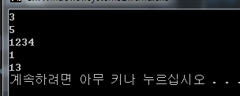

ILIL Code
----
```c#
class my_ilil {
  def sum (a,b) {
    ret a + b;
  }
  def sum2 (a,b) {
    ret a + a * b + b;
  }
  def hello (a) {
    [mscorlib]System.Console::WriteLine ( 1234 )
    [mscorlib]System.Console::WriteLine ( a )
    [mscorlib]System.Console::WriteLine ( a + 3 * 4 )
    ret 0
  }
}
```

C# Code
----
```c#
class Program
{
    static void Main(string[] args)
    {
        Console.WriteLine(my_ilil.sum(1, 2));
        Console.WriteLine(my_ilil.sum2(1, 2));
        my_ilil.hello(1);
    }
}
```

Build
----
```
make.rb ilil.il mydll
```

Result
----

