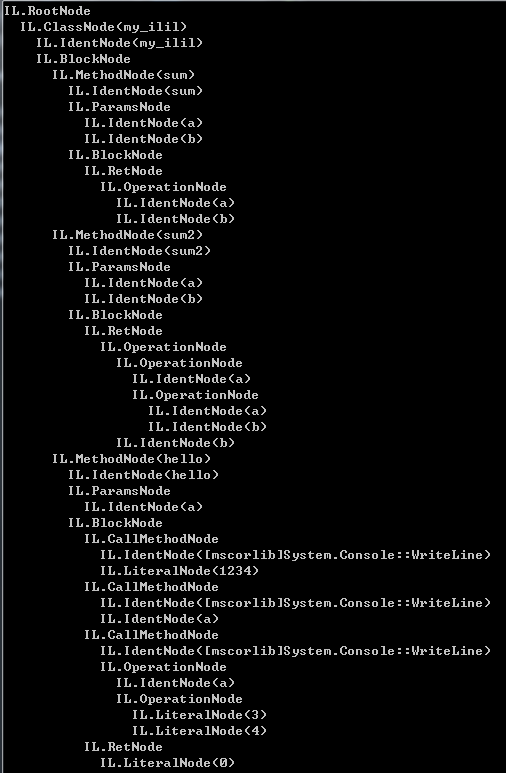

ILIL
====

A basic scriptable language which running on the [CLR](https://en.wikipedia.org/wiki/Common_Language_Runtime).

Main purpose
----
* Compiles the given code into [CIL](https://en.wikipedia.org/wiki/Common_Intermediate_Language).
* Lexical/S-Expression parsing
* AST Tree 

DAT
----
* This is a studying purpose project. Not a complete product.
* The source code is very messy, it may not be helpful.

Example
----
```c#
var src = "2 + sum(2, a+b, 3) + 3 + 2 * 2;";
var root =
    TreeBuilder.Build(
        Sexper.SexpPrefix(
            Lexer.Lex(src)));
            
root.Print();
root.Emit();
```

<br>


<br><br>
```c#
class my_ilil {
  def sum (a,b) {
    ret a + b;
  }
  def sum2 (a,b) {
    ret a + a * b + b;
  }
  def hello (a) {
    [mscorlib]System.Console::WriteLine ( 1234 )
    [mscorlib]System.Console::WriteLine ( a )
    [mscorlib]System.Console::WriteLine ( a + 3 * 4 )
    ret 0
  }
}
```

